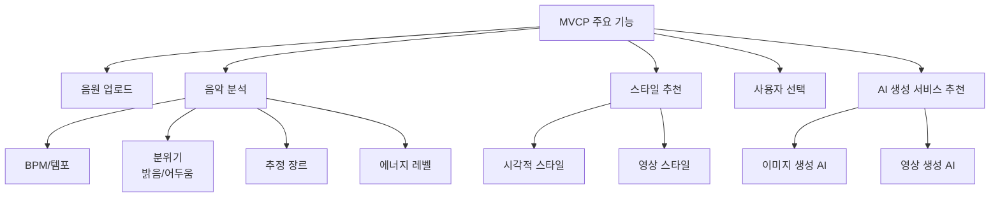
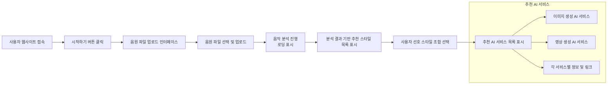
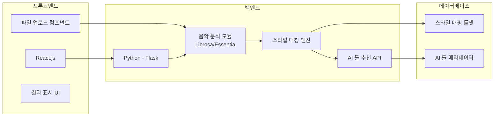
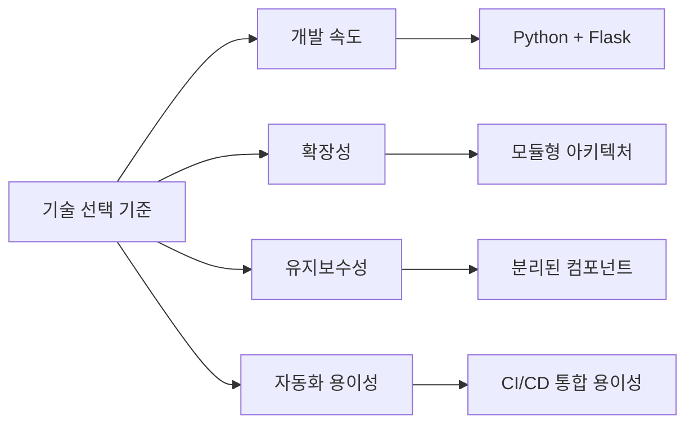
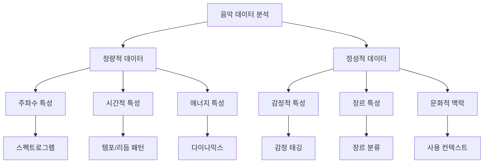
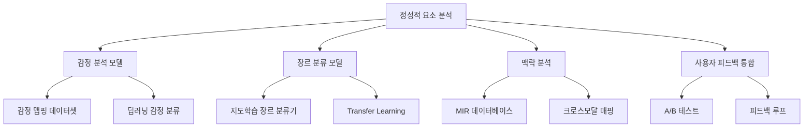
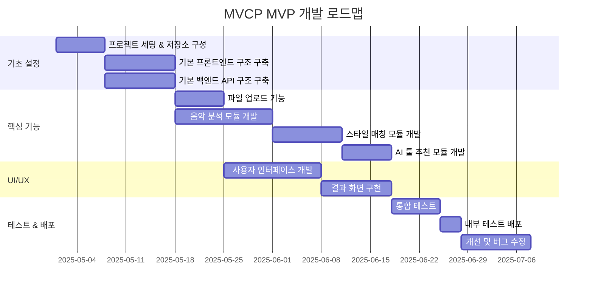

# MVCP (Music Video Creator Platform)
## 1차 MVP 기획서 - 내부용

---

## 목차

1. MVP 개요
2. 핵심 기능 구현 계획
3. 사용자 플로우
4. 기술 스택 및 구현 방안
5. 개발 로드맵

---

## 1. MVP 개요

- **개요:** 사용자가 업로드한 음원을 분석하여 비주얼 스타일을 추천하고, 적합한 AI 서비스 추천
- **목표:**
  - 음악 분석 → 스타일 추천 → AI 툴 추천의 핵심 플로우 구현
  - 기술적 타당성 검증 및 개발 방향성 확립

---

## 2. 핵심 기능 구현 계획

---

## 2.1 음원 업로드 및 분석

- **파일 업로드:**
  - 지원 포맷: MP3, WAV, FLAC
  - 파일 크기 제한: 50MB
  - 드래그 앤 드롭 및 파일 선택 인터페이스

- **음악 분석 모듈:**
  - BPM 및 템포 분석
  - 키(Key) 및 화성 구조 분석
  - 분위기 분석 (밝음/어두움, 에너지 수준)
  - 장르 추정

---

## 2.2 스타일 추천 및 매칭 로직

- **스타일 카테고리:**
  - 시각적 스타일 (10가지): 애니메이션, 실사, 몽환적, 사이버펑크, 빈티지 등
  - 영상 스타일 (5가지): 감성적, 역동적, 초현실적, 미니멀, 내러티브 중심 등

- **매칭 로직:**
  - 음악 특성과 스타일 태그 간 규칙 기반 매칭
  - 예: 빠른 템포 + 높은 에너지 = 역동적/사이버펑크 스타일 추천
  - 장르별 프리셋 스타일 활용 (Ex. EDM → 네온/미래적, 어쿠스틱 → 자연/빈티지)

---

## 2.3 AI 서비스 추천 시스템

- **AI 툴 데이터베이스:**
  - 이미지 생성 AI: Midjourney, Stable Diffusion, DALL-E 등
  - 영상 생성 AI: Pika, Runway, Kling, Sora 등

- **추천 매커니즘:**
  - 스타일 특성과 AI 툴 강점 매핑
  - 추천 시 제공 정보: 툴 이름, 특징, 가격, 링크, 활용 예시

---

## 3. 사용자 플로우

---

## 4. 기술 스택 및 구현 방안

---

## 4.1 프론트엔드 구현

- **기술 스택:**
  - React.js (상태 관리: Redux 또는 Context API)
  - 반응형 디자인 (모바일 지원)
  - 파일 업로드: React-Dropzone

- **주요 컴포넌트:**
  - 파일 업로드 인터페이스
  - 분석 로딩 화면 (로딩 애니메이션 및 진행 표시)
  - 스타일 추천 카드 컴포넌트
  - AI 툴 추천 결과 화면

---

## 4.2 백엔드 구현

- **기술 스택:**
  - Python + Flask/FastAPI
  - 음악 분석: Librosa/Essentia 라이브러리
  - 파일 처리: FFmpeg 통합

- **API 엔드포인트:**
  - `/upload` - 파일 업로드 및 저장
  - `/analyze` - 음악 파일 분석
  - `/recommend-styles` - 스타일 추천
  - `/recommend-tools` - AI 툴 추천

---

## 4.3 기술 스택 선택 이유

- **Python + Flask 선택 이유:**
  - 음악 분석 라이브러리(Librosa, Essentia)와의 직접 통합
  - 빠른 프로토타이핑과 MVP 개발 속도
  - 데이터 사이언스 및 ML 파이프라인과의 호환성

- **React 선택 이유:**
  - 컴포넌트 기반 아키텍처로 재사용성 향상
  - 상태 관리가 용이하여 복잡한 사용자 플로우 처리에 적합
  - 대규모 개발자 커뮤니티 및 풍부한 UI 라이브러리

- **자동화 관점의 기술 선택:**
  - CI/CD 파이프라인 구축이 용이한 기술 스택
  - 테스트 자동화(Jest, Pytest)와의 통합성
  - 배포 프로세스 자동화 용이(Docker, AWS/GCP와의 통합)

---

## 4.4 음악 분석 구현 상세

- **Librosa 라이브러리 활용:**
  - 템포 감지: `librosa.beat.tempo()`
  - 스펙트럼 분석: `librosa.feature.melspectrogram()`
  - 에너지 레벨: `librosa.feature.rms()`
  - 음색 분석: `librosa.feature.mfcc()`

- **매핑 알고리즘:**
  - 분석 결과를 0-1 범위로 정규화
  - 특성 벡터를 스타일 태그 매핑에 사용
  - 초기 버전: 규칙 기반 (if-then) 매핑
  - 향후: 머신러닝 기반 매핑 검토

---

## 4.5 멀티모달 음악 이해를 위한 데이터 분석

### 정량적 데이터 (객관적 측정)
- **음향학적 특성:**
  - **스펙트럼 중심(Spectral Centroid)**: 밝기/어두움 측정 (0-20kHz)
  - **템포/BPM**: 속도감 (40-200 BPM)
  - **스펙트럼 대비(Spectral Contrast)**: 음향적 대비 측정 (0-1)
  - **리듬 패턴**: 비트 강도와 분포 분석
  - **하모닉/퍼커시브 분리**: 멜로디와 타악기 성분 비율

### 정성적 데이터 (주관적/해석적)
- **감정적 특성:**
  - **Valence(긍정/부정)**: 음악이 전달하는 감정적 방향성 (-1~1)
  - **Arousal(각성/진정)**: 에너지와 흥분도 수준 (0-1)
  - **Dominance(지배/복종)**: 음악의 지배적/공격적 느낌 정도 (0-1)
  
- **장르 및 맥락적 특성:**
  - **장르 확률 분포**: 다양한 장르에 속할 확률
  - **시대적 특성**: 빈티지/모던 스펙트럼 위치
  - **문화적 연관성**: 특정 문화권과의 연관도

---

## 4.6 정성적 요소의 데이터 분석 방법

### 감정 분석 접근법
- **대규모 데이터셋 기반 학습:**
  - **MuSe 데이터셋**: 다양한 장르와 문화권의 2,000+ 곡에 감정 라벨링
  - **DEAM 데이터셋**: 초단위 감정 태깅이 포함된 1,800+ 곡의 데이터셋
  
- **딥러닝 기반 감정 분석:**
  - **CNN + LSTM 하이브리드 모델**: 스펙트로그램 패턴과 시간적 특성 동시 분석
  - **Transformer 기반 모델**: 음악의 구조적 문맥까지 파악하는 고급 분석
  - **앙상블 접근**: 여러 모델의 예측을 종합하여 정확도 향상
  
### 지도학습 + 비지도학습 조합
- **준지도 학습 접근법:**
  - 소량의 라벨링된 데이터와 대량의 비라벨 데이터 결합
  - 사전 훈련된 오디오 모델 활용 (예: PANNs, VGGish)
  
- **맥락 분석 기법:**
  - **문화적 맥락 마이닝**: 웹에서 수집된 음악 리뷰/설명 텍스트 분석
  - **협업 필터링**: 유사한 취향의 사용자 그룹 분석
  - **크로스모달 통합**: 음악-이미지-텍스트 간 의미론적 상관관계 활용

### 사용자 피드백 통합 시스템
- **A/B 테스트 프레임워크:** 추천 알고리즘 변형 실시간 테스트
- **사용자 인터랙션 로깅:** 클릭, 체류 시간, 선택 패턴 등 행동 데이터 수집
- **강화학습 적용:** 사용자 피드백을 보상 신호로 활용한 추천 시스템 개선

---

## 5. 개발 로드맵

ㄴ
---

## MVP 제외 기능 (참고)

- 컷 분할 및 프롬프트 자동 생성
- 플랫폼 내 직접적인 AI 이미지/영상 생성
- 프롬프트/이미지 편집 기능
- 사용자 계정 및 프로젝트 관리
- 결과물 저장 및 라이브러리
- 결제/유료 기능

---

## 감사합니다

### 질문이나 피드백 부탁드립니다